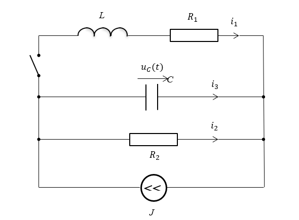
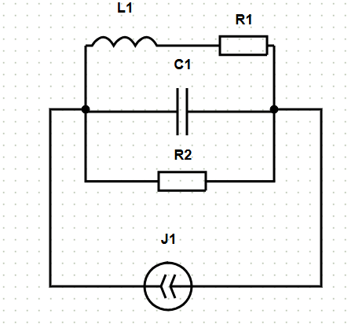
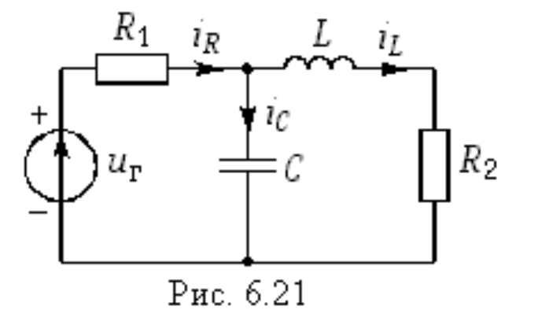
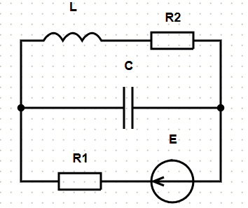

# BasalinLab1
Для запуска необходимо указать путь к арнументу в качестве аргумента\
**пример:**
```
cd build/
make
./BasalinLab1 ../inputCircuit.json
```
# Схема записи электрической цепи в json файл
В каждой цепи можно выделить узлы, между которыми проходят параллельные соединения, внутри параллельных соединений содержаться последовательные соединения\
**Шаблон json файла:**
```
{
    "branches": [
        [
            {
                "name": "",
                "type": "",
                "value":,
                "terminalIn":,
                "terminalOut":
            },
            // можно добавить последовательные соединения (terminalIn и terminalOut будут такими же, так как мы всё ещё в той же ветке)
        ],
        [
            // здесь можно задать дополнительные параллельные соединеиния, например, если terminalIn и terminalOut будут такими же, то ветка будет подсоеденена параллельно, а если terminalIn будет равен terminalOut предыдущей ветки, то ветка будет подсоеденена последовательно
        ],
    ],
    "outputs": ["R2", "C"] // здесь задаются элементы, ток на котрых мы хотим получить в качестве выходных занчений
}
```
> [!IMPORTANT]
> **Важно** заметить, что название элемента фактически играет роль ID элемента и должно быть уникальным

> [!NOTE]
> **Варианты type**:
>- VoltageSource
>- CurrentSource
>- Resistor
>- Capacitor
>- Inductor
# Разберём задание цепи на двух примерах
## 1. Пример цепи из методички
\
Перепишем цепь следующим образом:
\
Прекрасно видно, что у нас есть два узла, между котрыми есть 4 параллельных соединения:
- с катушкой и резистором R1
- с конденсатором
- с резистором R2
- с источником тока\
В качестве выходных параметров у нас ток на конденсаторе и резисторе R2\
Поэтому записмываем цепь следующим образом:
```
{
    "branches": [
        [
            {
                "name": "L",
                "type": "Inductor",
                "value": 0.1,
                "terminalIn": 0,
                "terminalOut": 1
            },
            {
                "name": "R1",
                "type": "Resistor", 
                "value": 1000.0,
                "terminalIn": 0,
                "terminalOut": 1
            }
        ],
        [
            {
                "name": "C",
                "type": "Capacitor",
                "value": 0.000001,
                "terminalIn": 0, 
                "terminalOut": 1
            }
        ],
        [
            {
                "name": "R2",
                "type": "Resistor",
                "value": 2000.0,
                "terminalIn": 0,
                "terminalOut": 1
            }
        ],
        [
            {
                "name": "J",
                "type": "CurrentSource",
                "value": 0.001,
                "terminalIn": 1,
                "terminalOut": 0
            }
        ]
    ],
    "outputs": ["R2", "C"]
}
```
## 2. Ещё пример
\
Снова перепишем цепь
\
Снова видно, что у нас есть два узла, между котрыми есть 3 параллельных соединения:
- с катушкой и резистором R2
- с конденсатором
- с резистором R1 и источником напряжения\
В качестве выходных параметров у нас ток на конденсаторе и резисторе R1\
Поэтому записмываем цепь следующим образом:
```
{
    "branches": [
        [
            {
                "name": "L",
                "type": "Inductor",
                "value": 0.8,
                "terminalIn": 0,
                "terminalOut": 1
            },
            {
                "name": "R2",
                "type": "Resistor", 
                "value": 5.0,
                "terminalIn": 0,
                "terminalOut": 1
            }
        ],
        [
            {
                "name": "C",
                "type": "Capacitor",
                "value": 0.5,
                "terminalIn": 0, 
                "terminalOut": 1
            }
        ],
        [
            {
                "name": "Г",
                "type": "VoltageSource",
                "value": 1.2,
                "terminalIn": 1,
                "terminalOut": 0
            },
            {
                "name": "R1",
                "type": "Resistor",
                "value": 7.0,
                "terminalIn": 1,
                "terminalOut": 0
            }
        ]
    ],
    "outputs": ["R1", "C"]
}
```
> [!IMPORTANT]
> Можно назметить, что в поcледней веткt мы записываем сначала источник напряжения, а потом резистор, потому что мы задаём направление от 1 узла к 0